# Робота з репозиторієм
Склонуйте оригінальний репозиторій https://github.com/portapack-mayhem/mayhem-firmware за допомогою команди
```bash
git clone --recurse-submodules git@github.com:portapack-mayhem/mayhem-firmware.git
```
і перенесіть файли з флеш накопичувача або цього репозиторія до склонованого репозиторію

# Білд

Застосунок має знаходитись в `firmware/application/external/ext_scanner`

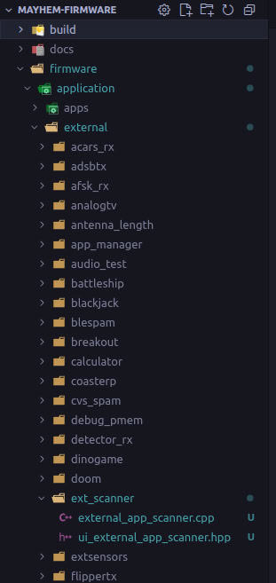

Білд за допомогою `dockerize.sh`


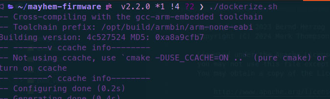

Переносити треба файли `build/firmware/portapack-mayhem-firmware.bin`, `build/firmware/portapack-mayhem_OCI.ppfw.tar` і `build/firmware/firmware_tar/APPS/ext_scanner.ppma`.


Переносити можна за допомогою `build.sh` скріпту, але треба додати шлях до флешки (`DEVICE_ID`)


Не забудьте додати застосунок в `external.cmake` і `external.ld` файли, які знаходяться в `firmware/application/external`. Див. їх контент можна знайти в прикріплених файлах.

А також оновити `external_app_info.py`, який знаходиться в `firmware/tools`. Його контент можна знайти в прикріплених файлах.

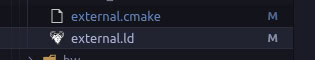

# Використання

## Застосунок

Застосунок знаходиться в меню `Utilities`

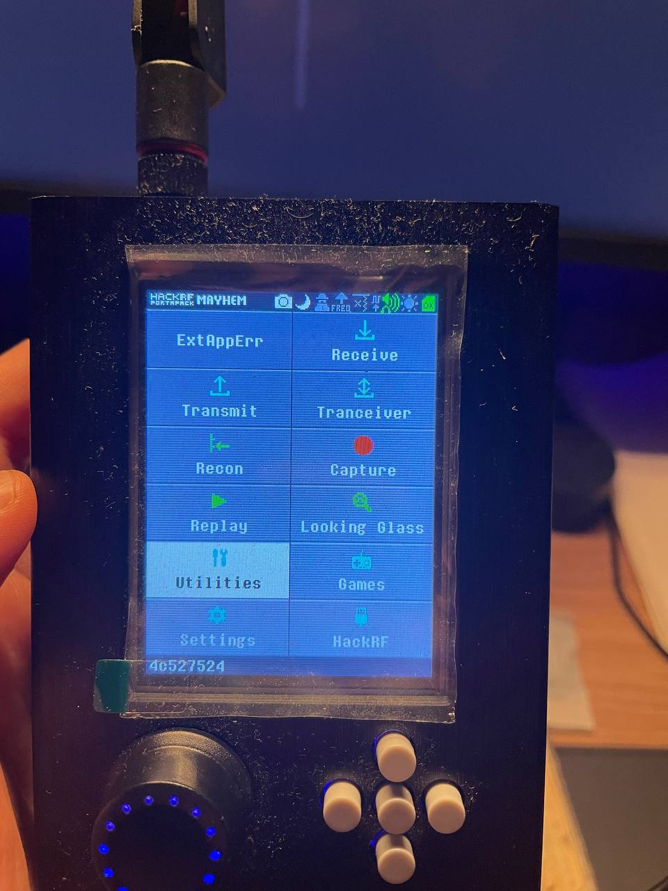

під назвою `Spectrum Scan`

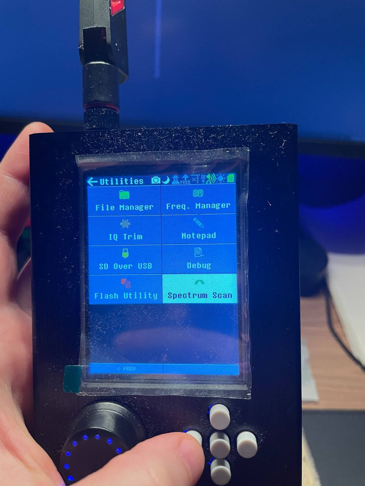

### START
Кнопка `START` запускає сканування в обраних діапазонах (`ranges`) сигналів обраної ширини (можна обрати мінімальну і максимальну) (`BW Min`/`BW Max`) і з обраною силою сигналу (вище за) (`threshold`).

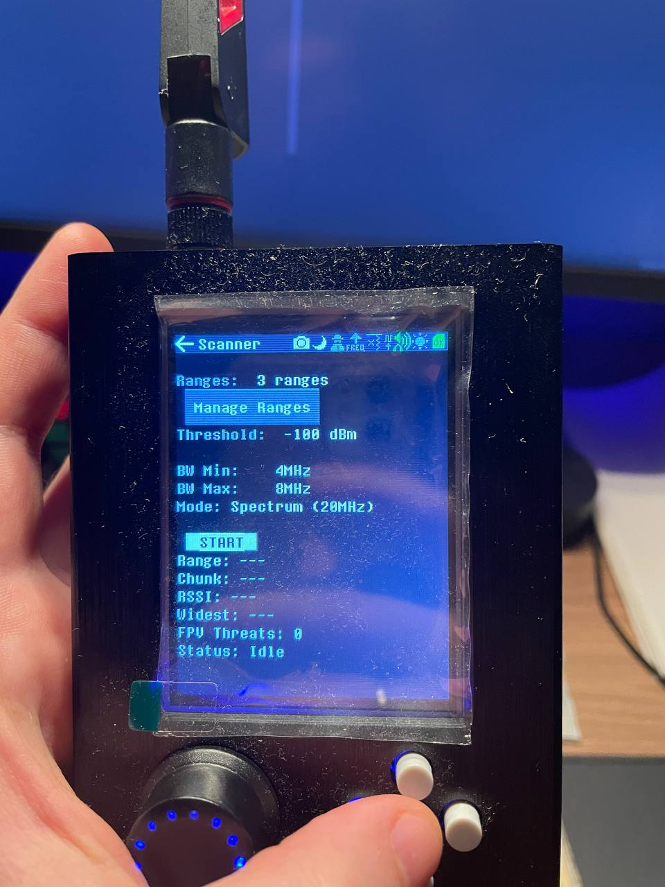

Після запуску, сканер почне сканувати обрані діапазони і якщо буде знайдено куполоподібний сигнал, який підходить під наші налаштування, сканер видасть короткий сигнал і продовжить сканування. Кожен знайдений сигнал буде супроводжуватись коротким звуковим сигналом. Коли сканер добіжить кінця останнього діапазону, він обере найсильніший сигнал, виведе його на екран і видасть довший звуковий сигнал.
Якщо за всі діапазони не було знайдено жодного підходящого сигналу, сканер продовжить сканування допоки сигнал не знайдеться, або користувач не припинить сканування. 

### Manage ranges
Кнопка `Manage ranges` відкриває меню налаштувань діапазонів


де можна налаштовувати діапазони, додавати нові і вікдлючати або видаляти існуючі (видалення працює в межах одного використання, після перезапуску застосунку все скинеться і знову будуть запропоновані 3 діапазони за замовчуванням).


## Трансфер файлів

Трансфер файлів здійснюється шляхом підключення флеш карти до компьютера через кард рідер або ж за допомогою утіліти під назвою `SD Over USB`.

### SD Over USB
Ця утіліта знаходиться в меню `Utilities`


під назвою `SD Over USB`.

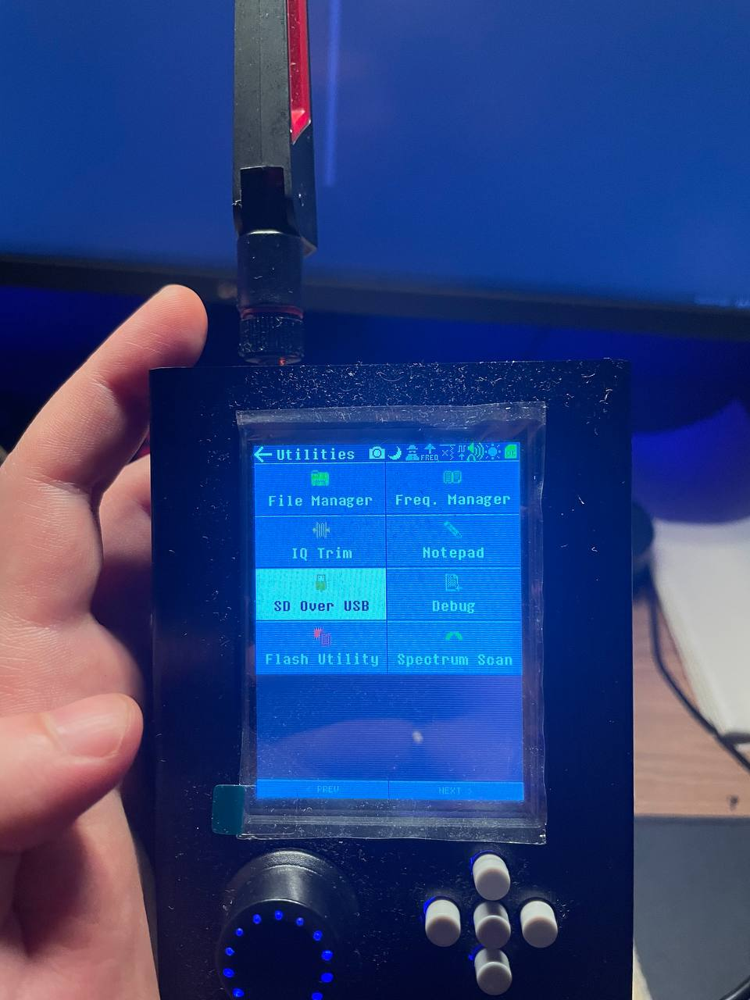

Після її відкриття буде вікно підтвердження, де потрібно натиснути `Run`.

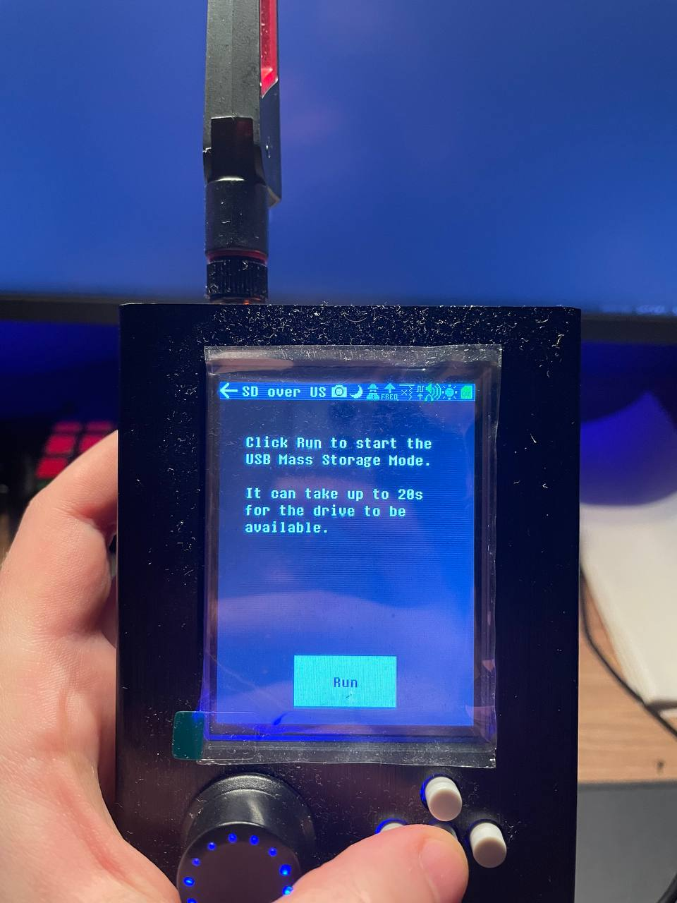

Девайс має виглядати ось так:


Після цього, через декілька секунд, флеш карта з'явиться в списку девайсів компьютера і на неї можна буде переносити файли.


Щоб вийти з режиму SD Over USB потрібно натиснути кнопку RESET зверху девайсу (кнопка праворуч):

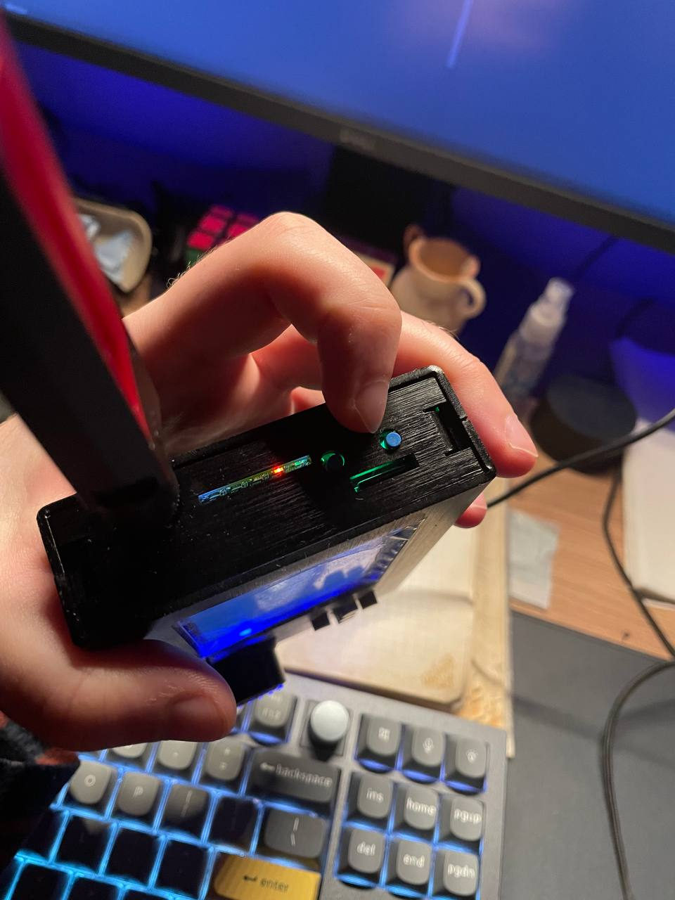

## Прошивка

Щоб перепрошити девайс з новим застосунком потрібно скористатися утілітою під назвою `Flash Utility`.

Ця утіліта знаходиться в меню `Utilities`


під назвою `Flash Utility`.


Після її відкриття потрібно буде обрати файл, з якого потрібно встановити прошивку. Якщо ви просто копіюєте файли на флеш накопичувач без зміни їх імен або використовуєте `move.sh`, то вам просто потрібно обрати перший файл у списку

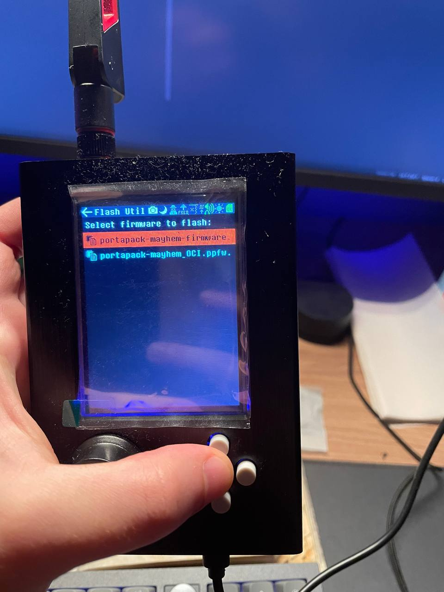

і підтвердити встановлення прошивки.


Після цього девайс почне процес інсталяції і перезапуститься через декілька секунд.

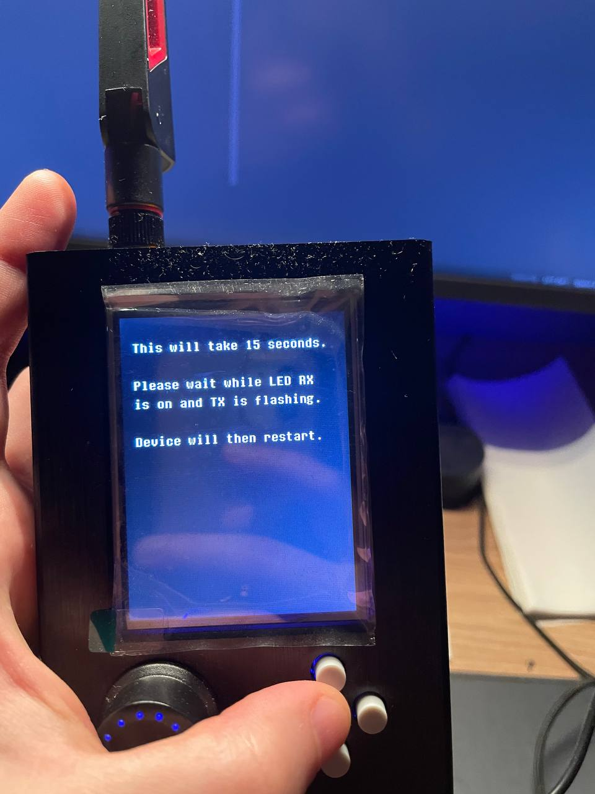